# MISP reporting

**MISP reporting** lets you explore the threat information stored in your MISP instance. It provides an overview of   
- the trend in the volume of events and attributes  
- the distribution of attribute types  
- recent activity by key organisations  
- threat level and TLP classification of events  
- targeted geographies and sectors  
- TTPs used by threat actors  
- vulnerabilities and weaknesses referenced in threat events  

**MISP reporting** queries your instance, summarises the data, and outputs **HTML reports** together with a **JSON statistics** file. The generated **graphs** can also be embedded in other reporting tools.

# Setup

MISP reporting is written in Python and requires a MISP API key.

Because the web server must read and write the files, ownership must be set to the web‑server user. On Ubuntu this user is `www-data`; on Red Hat it is `apache`. Run the following commands as the appropriate user (replace `www-data` with `apache` on Red Hat).

**Step 1: Create the reporting directory and clone the repository**

Custom MISP scripts are best placed in a dedicated directory such as `/var/www/MISP/misp-custom/`. Create it if necessary and clone the project.

```bash
sudo -u www-data mkdir /var/www/MISP/misp-custom/
sudo -u www-data git clone https://github.com/cudeso/misp-reporting.git
cd misp-reporting
```

**Step 2: Set up a Python virtual environment and install dependencies**

To keep system packages untouched, create a dedicated virtual environment named `venv`. If `virtualenv` is unavailable you may use `python3 -m venv venv`.

```bash
sudo -u www-data virtualenv venv
sudo -u www-data venv/bin/pip install -r requirements.txt
```

**Step 3: Configure the application**

Copy the default configuration and edit it to suit your environment.

```bash
sudo -u www-data cp config.py.default config.py
```

At a minimum you must set  

- **misp_url** – the URL of your MISP instance  
- **misp_key** – an API key (ideally for an account with the *admin* role)  
- **output_dir** – where reports will be written  
- **install_dir** – where MISP reporting is installed  

**Step 4: Create the output directories**

Reports are written to `output_dir`, usually `/var/www/MISP/app/webroot/misp-reporting`. The directory must also contain a copy of the *assets* folder, which holds the logos of key MISP organisations.

```bash
sudo -u www-data mkdir /var/www/MISP/app/webroot/misp-reporting/
sudo -u www-data cp -r /var/www/MISP/misp-custom/misp-reporting/assets /var/www/MISP/app/webroot/misp-reporting/
chown -R www-data:www-data /var/www/MISP/app/webroot/misp-reporting/
```

**Step 5: Add your organisation’s logo**

Copy your logo (and those of other key organisations) into the `assets` directory:

```bash
sudo -u www-data cp logo.png /var/www/MISP/app/webroot/misp-reporting/assets/
```

**Step 6: Run the reporting script**

Generate the reports:

```bash
sudo -u www-data /var/www/MISP/misp-custom/misp-reporting/venv/bin/python /var/www/MISP/misp-custom/misp-reporting/reporting.py
```

The reports are now available at `https://<MISP>/misp-reporting/`.

# Cronjob

To run the report daily, add a cronjob for the web‑server user:

```bash
crontab -u www-data -e
```

Insert the following line (adjust the path if required):

```bash
00 6 * * * cd /var/www/MISP/misp-custom/misp-reporting/ ; /var/www/MISP/misp-custom/misp-reporting/venv/bin/python /var/www/MISP/misp-custom/misp-reporting/reporting.py
```

# Reports

Three report types are planned. The **summary** and **curation overview** are complete; **infrastructure monitoring** is in progress.

## Summary report

The summary report presents high‑level statistics for your MISP server. The header also links to the other reports and provides a button to log in to MISP.

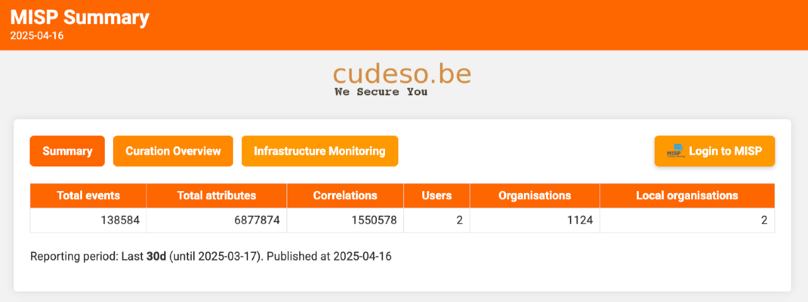

It begins with a summary of published events. Based on `reporting_period`, `reporting_trending_count`, and `reporting_filter`, you see the trend in published events and their attributes.

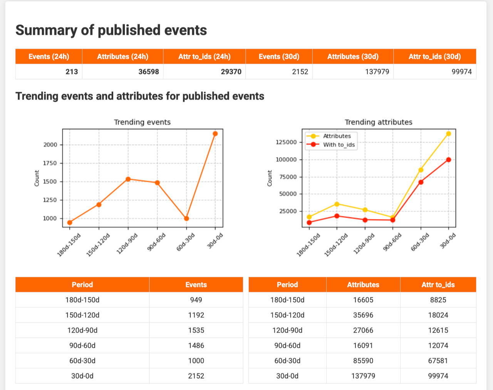

The next section examines attribute details, showing which attribute types appeared during the last 24 hours and other periods. The breakdown is controlled by `attribute_summary`.

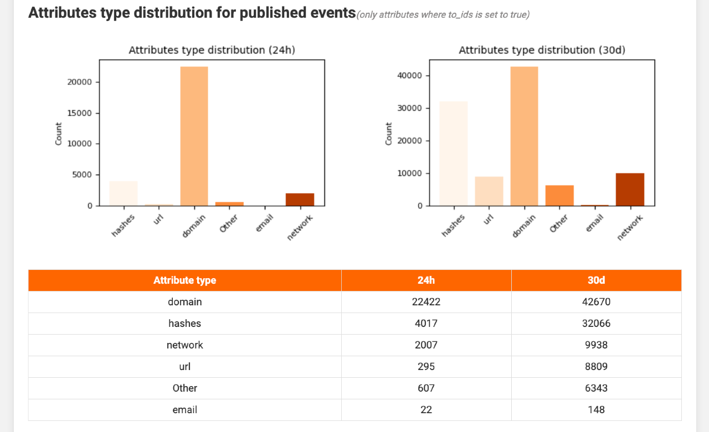

A further section highlights key organisations (defined in `key_organisations`), listing event and attribute counts for the past 24 hours and the current reporting period. Direct links open the corresponding events in MISP.

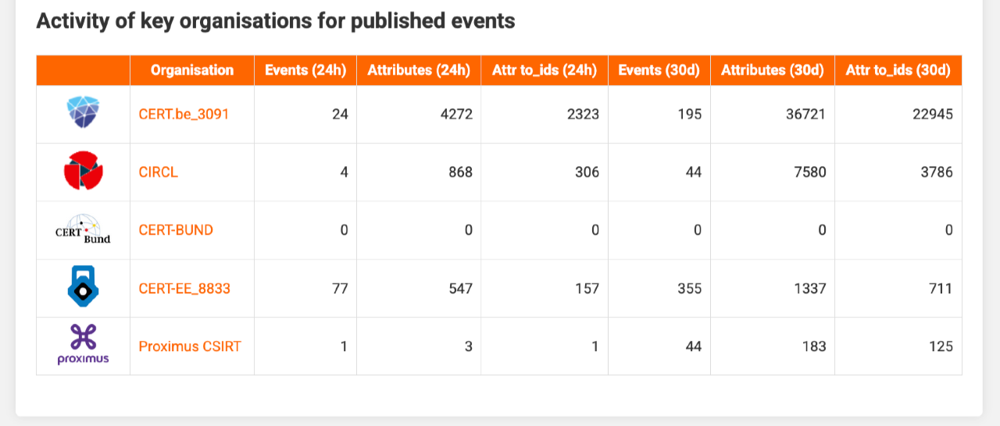

Threat level and Traffic Light Protocol (TLP) designations follow, enabling you to spot spikes in high‑severity or specific TLP‑tagged events at a glance.

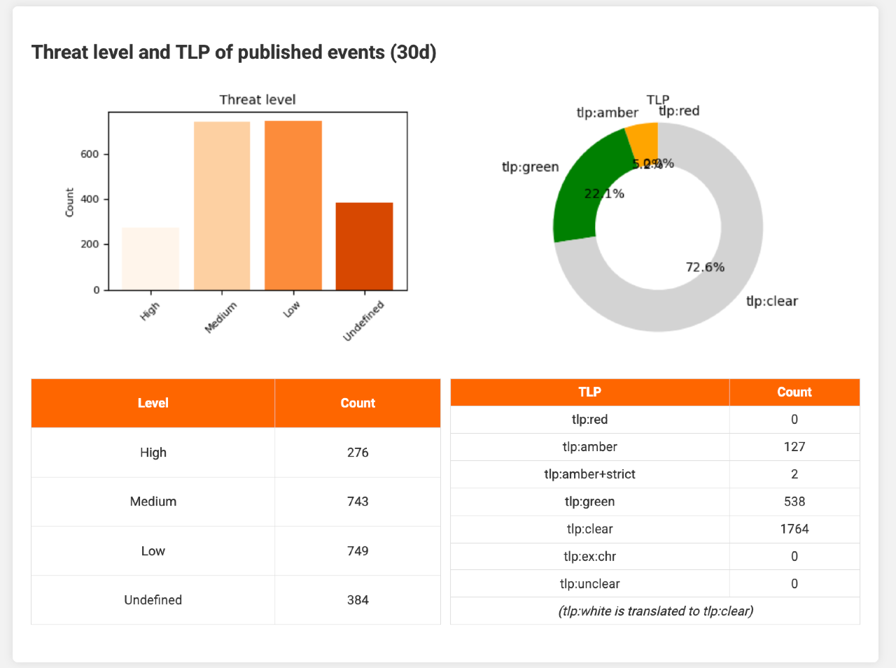

Two charts then show which countries or regions were targeted and which sectors were attacked, using galaxy tags set in `filter_geo` and `filter_sector`.

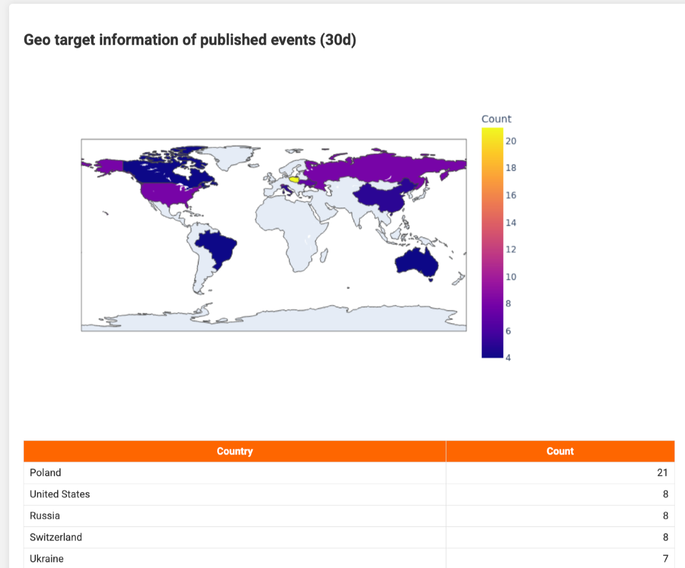

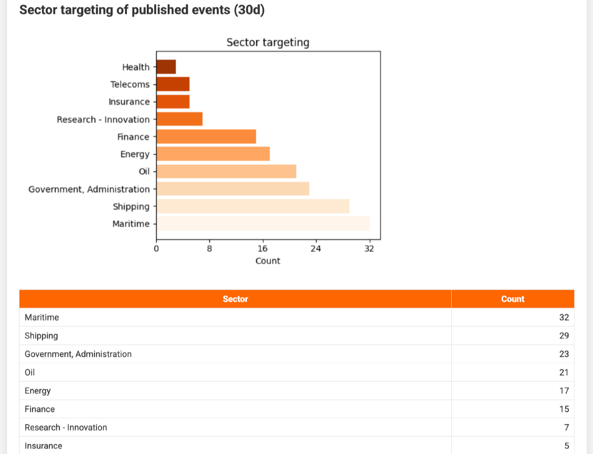

Similarly, threat actors (`filter_ttp_actors`) and attack techniques (`filter_ttp_pattern`) are listed.

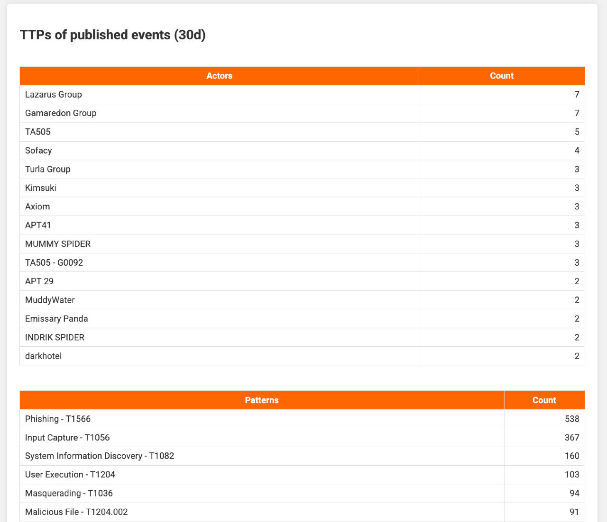

Finally, the report summarises all CVEs referenced in events. Additional details, such as descriptions and CVSS scores, are retrieved from cvepremium.circl.lu (`cve_url`). CVEs above the threshold set in `reporting_cve_highlight` are emphasised.

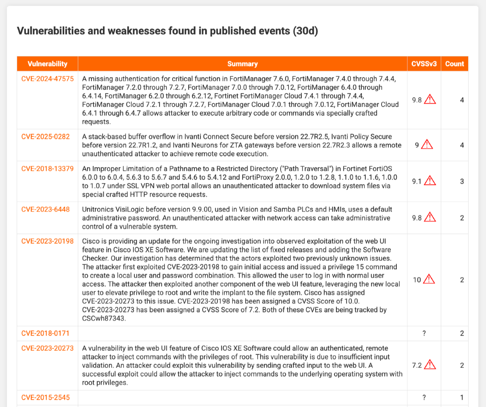

## Curation report

The curation report shows how many threat events have been curated—either automatically or manually. A typical **curation process** checks events against the MISP warninglists and the CIRCL Hashlookup service; matches lead to indicators being marked non‑actionable (the *to_ids* flag is cleared). Curation may also enrich events with contextual data. In this setup, curated events are placed in the local workflow state *complete*; uncurated events remain *incomplete*.

The opening section lists how many events are awaiting curation, how many high‑threat events are waiting, and how many events from completely reliable sources are pending. Links take you straight to each set in MISP.

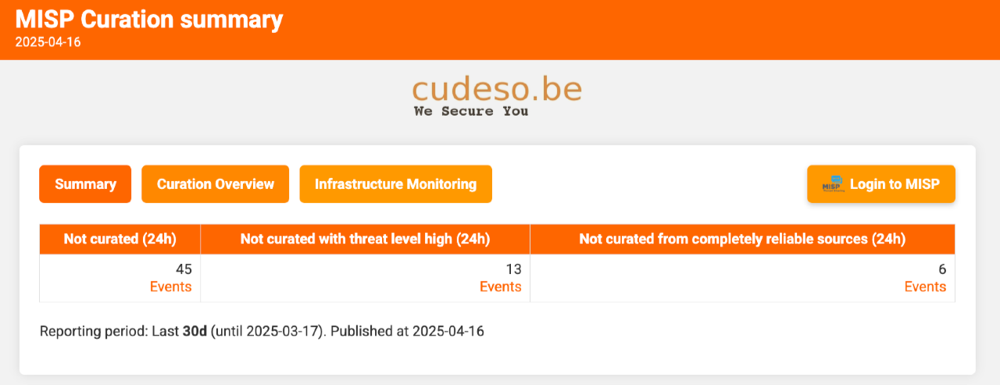

Next, the report plots the dates of curated and uncurated events so you can see whether outstanding items are recent or historic.

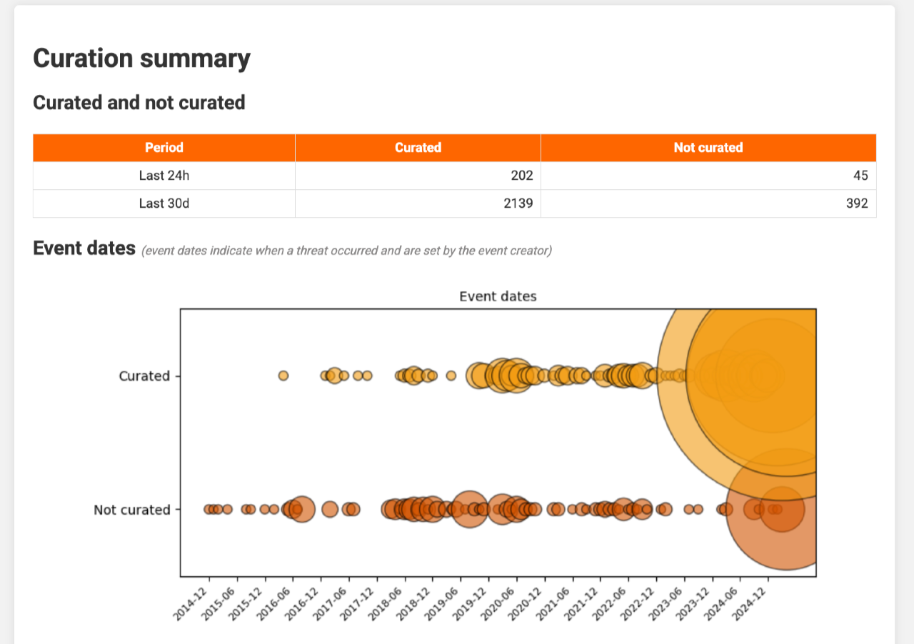

You can also view the volume of curated versus uncurated events per organisation.

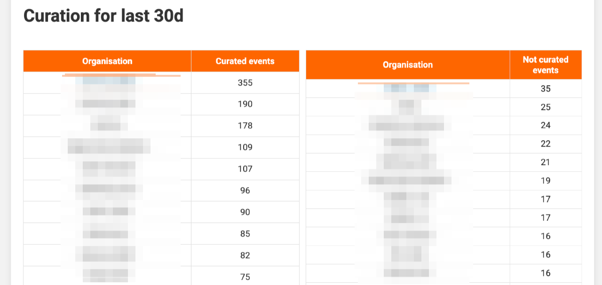

Finally, a table lists the individual events, highlighting those with high threat levels and those from fully reliable sources. This helps you prioritise urgent reviews. For automation ideas see the MISP playbook [Curate threat events](https://misp.github.io/misp-playbooks/misp-playbooks/pb_curate_misp_events-with_output.html).

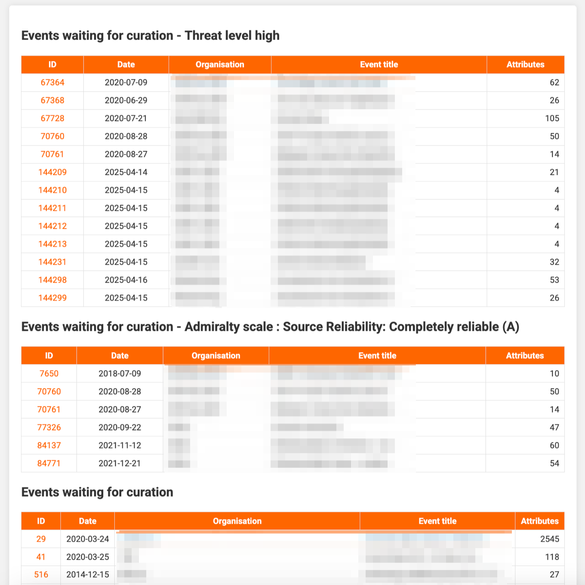

## Statistics file

Besides the HTML reports, misp‑reporting creates a JSON file, `statistics.json`, suitable for other tools:

```
{
    "misp_server": "https://misp",
    "report_date": "2025-04-16",
    "statistics": "{'event_count': 138584, 'attribute_count': 6877874, 'user_count': 2, 'org_count': 1124, 'local_org_count': 2}",
    "today_statistics": "{'today_event_count': 36598, 'today_attribute_count': 36598, 'today_attribute_ids_count': 29370}",
    "today_statistics_attributes": "{'hashes': 4017, 'url': 295, 'domain': 22422, 'Other': 607, 'email': 22, 'network': 2007}"
}
```

## Graphics

All images are stored in the report directory and may be reused elsewhere:

- `attributes_bar_chart.png`  
- `attributes_type_bar_chart.png`  
- `curated_events_bubble_chart.png`  
- `geo_targeting_map.png`  
- `threatlevel_bar_chart.png`  
- `threat_levels_bar.png`  
- `tlp_pie_chart.png`  
- `attributes_trending.png`  
- `attributes_type_daily_bar_chart.png`  
- `events_trending.png`  
- `threatlevel_pie_chart.png`  
- `threat_levels_pie.png`  
- `trending_graph.png`

## Prevent unauthenticated access

By default, everything under `/var/www/MISP/app/webroot/misp-reporting` is publicly accessible. To restrict access, modify MISP core as explained in [github.com/MISP/MISP/issues/10272](https://github.com/MISP/MISP/issues/10272) by editing `/var/www/MISP/app/AttributesController.php`.

# Configuration options

The configuration is handled in `config.py`.

Set the log file (`logfile`), logger name (`logname`), and whether to log uncurated events (`log_incomplete`):

```
config = {
        "logfile": "/var/www/MISP/app/tmp/logs/misp-reporting.log",
        "logname": "misp-reporting",
        "log_incomplete": False,
```

Define the length of the reporting period (`reporting_period`), how many periods to display (`reporting_trending_count`), and any event filter (`reporting_filter`). `reporting_eventdetails_onlykeyorgs` determines whether to print event details later (see `print_event_details`). `reporting_filter_timestamp` lets you trend on either *timestamp* or *published* dates.

```
        "reporting_period": "30d",
        "reporting_filter": None,
        "reporting_eventdetails_onlykeyorgs": True,
        "reporting_trending_count": 6,
        "reporting_filter_attribute_type_ids": True,
        "reporting_filter_timestamp": "published",
        "reporting_filter_published": True,

        "print_event_details": False,
```

MISP connection settings follow. Provide the instance URL, whether to verify the certificate, and an API key. `misp_page_size` controls pagination. `cve_url` and `vulnerability_lookup_url` supply vulnerability information. `reporting_cve_highlight` sets the CVSS threshold for highlighting CVEs.

```
        "misp_url": "",
        "misp_verifycert": False,
        "misp_key": "",
        "misp_page_size": 200,
        "cve_url": "https://cvepremium.circl.lu/api/cve/",
        "vulnerability_lookup_url": "https://vulnerability.circl.lu/vuln/",

        "reporting_cve_highlight": 7,
```

Filter options:

```
        "filter_sector": "misp-galaxy:sector",
        "filter_sector_count": 10,
        "filter_geo":  "misp-galaxy:target-information",
        "filter_geo_count": 10,
        "filter_ttp_actors": ["misp-galaxy:threat-actor", "misp-galaxy:mitre-intrusion-set"],
        "filter_ttp_actors_count": 15,
        "filter_ttp_pattern": ["misp-galaxy:mitre-attack-pattern"],
        "filter_ttp_pattern_count": 15,
```

Attribute groupings:

```
        "attribute_summary": {"network": ["ip-src", "ip-dst", "ip-src|port", "ip-dst|port"],
                              "hashes": ["sha1", "sha256", "md5", "filename|sha256", "filename|sha1", "filename|sha256", "filename|md5", "filename|sha256"],
                              "domain": ["hostname", "domain", "domain|ip"],
                              "url": ["url"],
                              "email": ["email", "email-src", "email-dst"],
                              "vulnerability": ["vulnerability", "cpe", "weakness"]},
        "attribute_other": "Other",
```

Key organisations and their logos:

```
        "key_organisations": {"5cf66e53-b5f8-43e7-be9a-49880a3b4631": {"logo": "5cf66e53-b5f8-43e7-be9a-49880a3b4631.png"},
                              "55f6ea5e-2c60-40e5-964f-47a8950d210f": {"logo": "55f6ea5e-2c60-40e5-964f-47a8950d210f.png"},
                              "56a64d7a-63dc-4471-bce9-4accc25ed029": {"logo": "56a64d7a-63dc-4471-bce9-4accc25ed029.png"},
                              "56e02aba-9dd0-49ea-bd95-026e55fec118": {"logo": "56e02aba-9dd0-49ea-bd95-026e55fec118.png"},
                              "5677fc72-f46c-49f3-b5f3-7245ff32448e": {"logo": "5677fc72-f46c-49f3-b5f3-7245ff32448e.png"}},
```

Installation paths, templates, and appearance:

```
        "output_assets": "assets",
        "output_dir": "/var/www/MISP/app/webroot/misp-reporting",
        "install_dir": "/var/www/MISP/misp-custom/misp-reporting",
        "template_css": "templates/style.css",
        "template_html": "templates/template.html",
        "template_curation_html": "templates/template_curation.html",
        "template_infrastructure_html": "templates/template_infrastructure.html",
        "noimage_path": "no-image-32.png",
        "logo": "assets/cudeso.png",

        "distribution": ["Your organisation", "This community", "Connected communities", "All communities", "Sharing group"],
        "analysis": ["Initial", "Ongoing", "Completed"],
        "threatlevel_key_mapping": {'1': 'High', '2': 'Medium', '3': 'Low', '4': 'Undefined'},
        "tlp_ignore_graph": ['tlp:unclear', 'tlp:ex:chr', 'tlp:amber+strict'],
        "workflow_complete": "workflow:state=\"complete\"",
        "workflow_incomplete": "workflow:state=\"incomplete\"",
}
```
