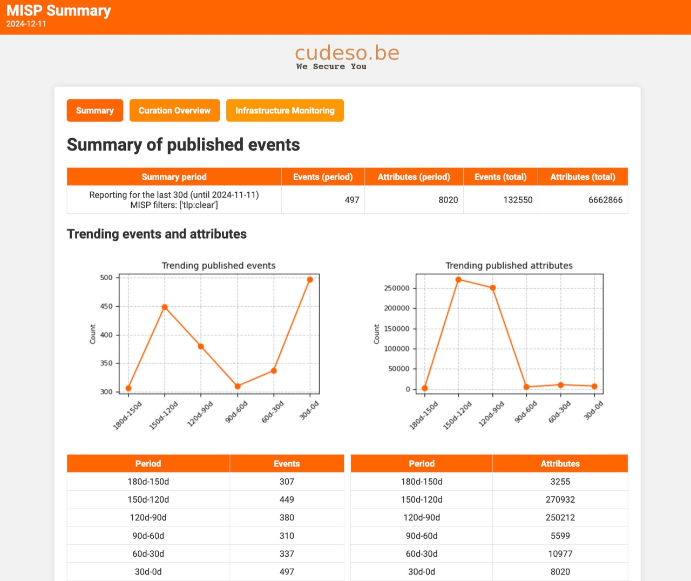
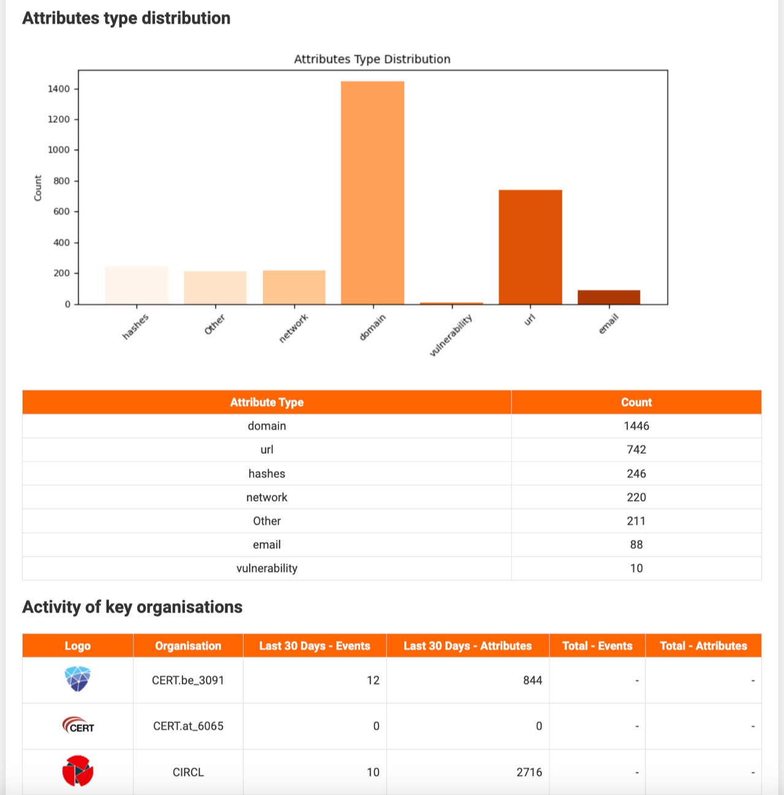
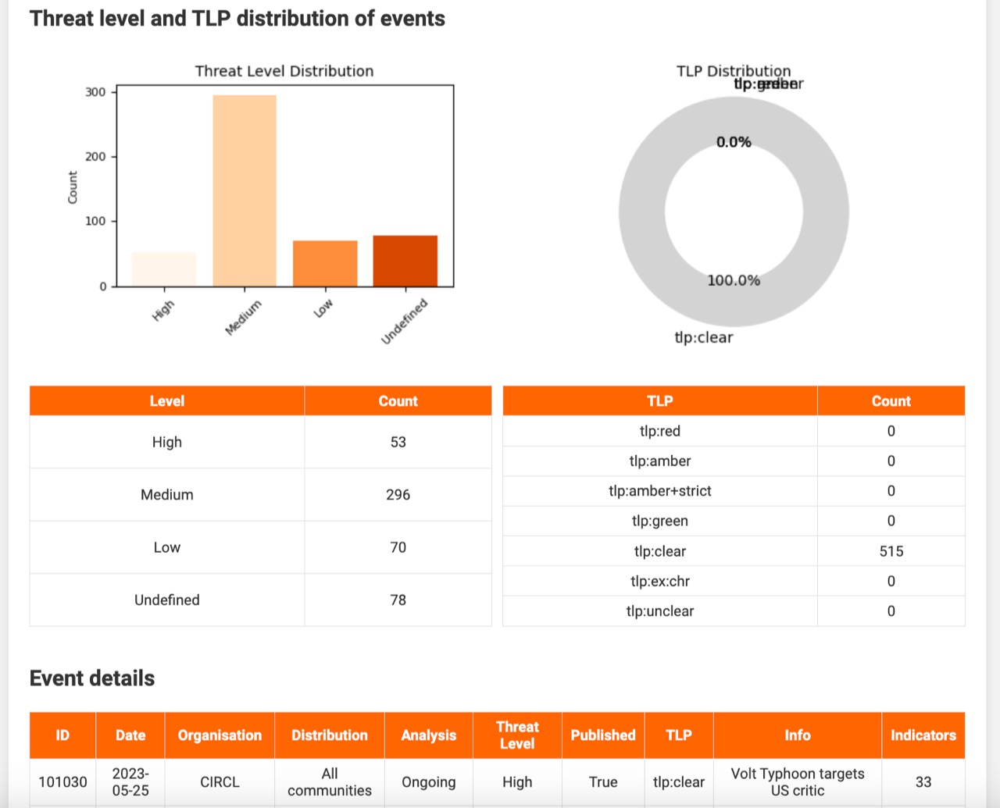
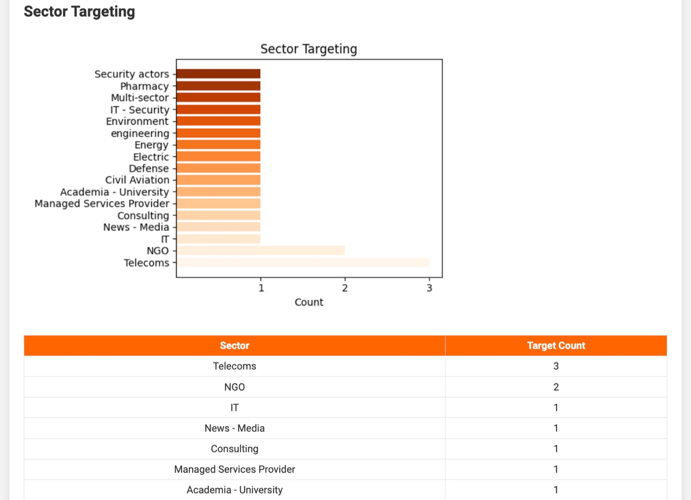
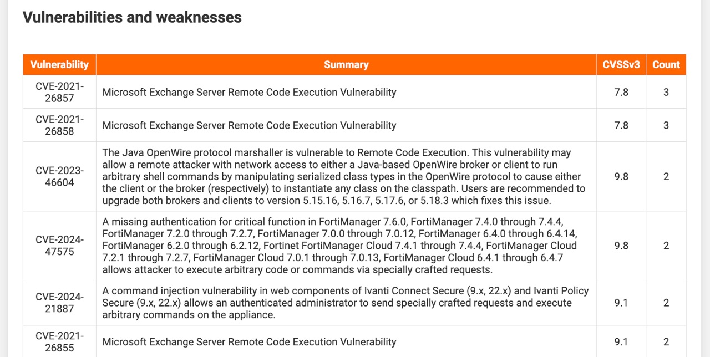
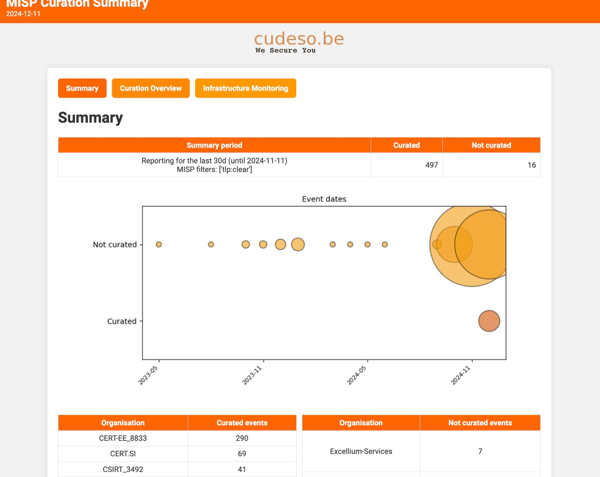

# MISP reporting

Create reports of MISP usage.

# Setup

By default, this reporting functionality is available via the MISP web server at `https://MISP/misp-reporting/`.

To ensure the web server can access the files, they must be owned by the appropriate web server user. On Ubuntu systems this user is `www-data`, and on Red Hat systems it is `apache`. Make sure to run the following commands as the web server user.

In this example, all customizations are placed in the `misp-custom` directory within the MISP installation folder.

**Step 1: Create the reporting directory and clone the repository**

```bash
mkdir /var/www/MISP/misp-custom/reporting
git clone https://github.com/cudeso/misp-reporting.git
cd misp-reporting
```

**Step 2: Set up a Python virtual environment and install dependencies**

```bash
virtualenv venv
source venv/bin/activate
pip install -r requirements.txt
```

**Step 3: Configure the application**

Copy the default configuration file and update it with your MISP URL, API key, and desired output location.

```bash
cp config.py.default config.py
```

**Step 4: Create the output directories**

Reports will be stored in the following directories, so you need to create them beforehand:

```bash
mkdir /var/www/MISP/app/webroot/misp-reporting/
mkdir /var/www/MISP/app/webroot/misp-reporting/assets
```

**Step 5: Add your organization's assets**

Copy your organization's logo and any other key organizational logos into the `assets` directory:

```bash
cp logo.png /var/www/MISP/app/webroot/misp-reporting/assets/
cp circl.png /var/www/MISP/app/webroot/misp-reporting/assets/
```

**Step 6: Run the reporting script**

Finally, generate your reports by running the reporting script:

```bash
python reporting.py
```

Your reports should now be generated and accessible via the MISP web server.

# Cronjob

I create the reports from a cronjob with this entry

```
00 6 * * *    cd /var/www/MISP/misp-custom/reporting/misp-reporting/ ; /var/www/MISP/misp-custom/reporting/misp-reporting/venv/bin/python /var/www/MISP/misp-custom/reporting/misp-reporting/reporting.py
```

# Demo output













# Limit access to authenticated users only

Edit `app/Controller/AttributesController.php`

```
    public function mispreporting($filename)
        {
            $filename = preg_replace("/[^a-zA-Z0-9\._]+/", "", $filename);
            $filepath = APP . '/files/mispreporting/' . $filename;
            if (file_exists($filepath)) {
                $this->response->file($filepath, ['download' => false, 'name' => $filename]);
                return $this->response;
            }
            throw new NotFoundException(__('Invalid file. Are you sure you\'re in the right signal chat?'));
        }
```